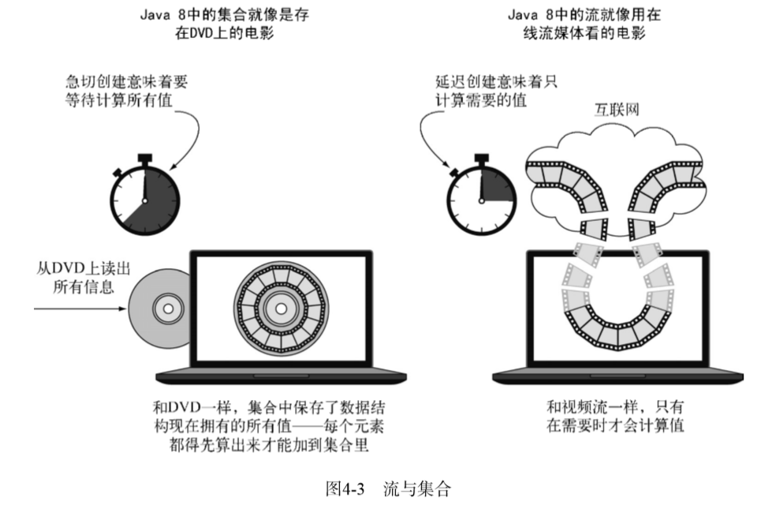

# java中的流和集合的区别

### 哲学中的流和集合

 对于喜欢哲学的读者，你可以把流看作在时间中分布的一组值。相反，集合则是空间（这 里就是计算机内存）中分布的一组值，在一个时间点上全体存在——你可以使用迭代器来访问 for-each循环中的内部成员

流的流水线背后的理念类似于**构建器模式**。在构建器模式中有一个调用链用来设置一套配 置（对流来说这就是一个中间操作链），接着是调用built方法（对流来说就是终端操作）。 

